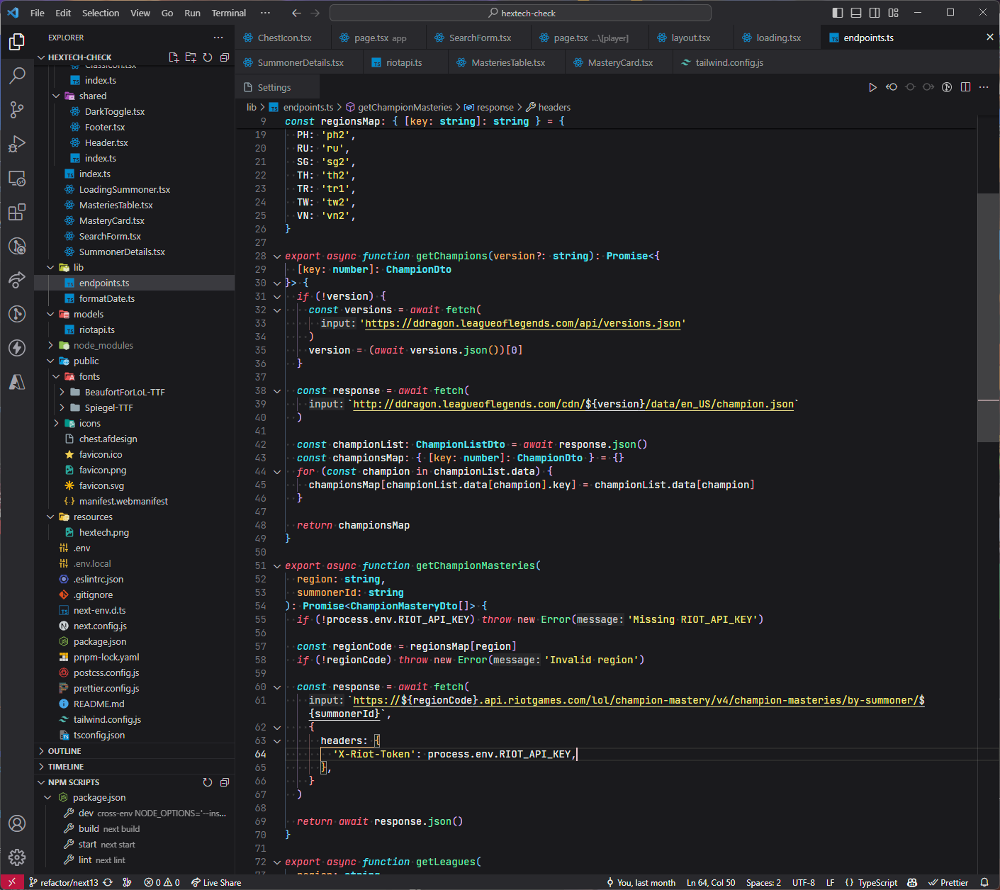

# galewind-theme

Dark color theme using colors from Tailwind CSS documentation.

Other "dark" themes on the market use the brightest shade of gray possible. This theme provides an actual dark theme experience while not being completely pitch black.

The colorful syntax highlighting from this theme complements the dark background nicely, giving users an aesthetically pleasing working environment while also being practical.
